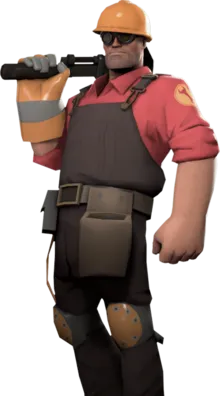

# Presentación

## Estudiante: Santiago Blastre

Description: Ingresé el 2020, curse todas las materias de primer año y aprobe todas ~~pero no aprobe el final de algoritmos aun~~.

###### Tengo demasiada diversión con programación de lo normal

* Veo y critico peliculas series (mayormente veo Sci-Fi y Acción, como Inception, Man of Steel, Winter Soldier, Live Die Repeat, Dune)
* Raramente leo libros (excepto cuando se necesita leér).
* Juego videojuegos (Hollow Knight (Modded), Risk of Rain 2, ULTRAKILL, Metal Gear Rising: Revengeance, etc...), y mezclo desafios de videjuegos con ejercitaciones físicas (Recibe daño una vez => Hace 10 lagartijas, o also asi).
* Escucho musica electronica (no del tipo comun) y a veces escucho clasico/orchestra ¿el silencio cuenta como musica?
* Me gustan las verduras, pero mas que nada, me gusta el A R R O Z .

--------------------------------
Engineer Gaming

--------------------------------

_Suerte para todos ustedes cursando esta materia._

Seguí los pasos del doc ~~acá~~ (Gracias por el link profe)